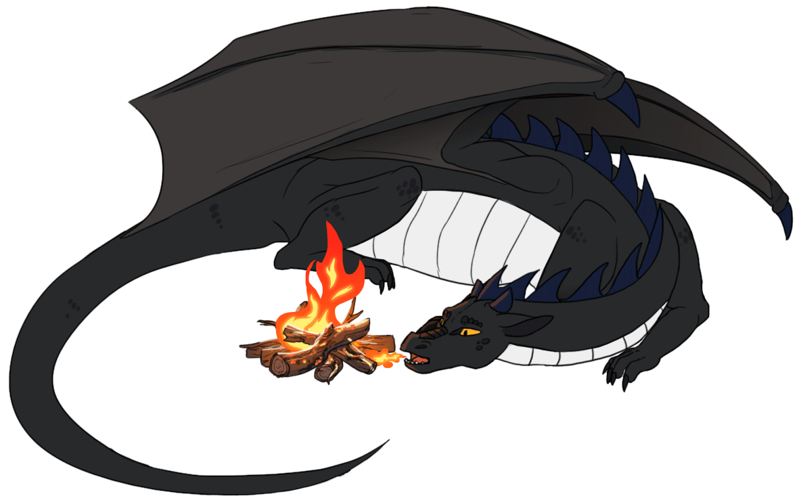
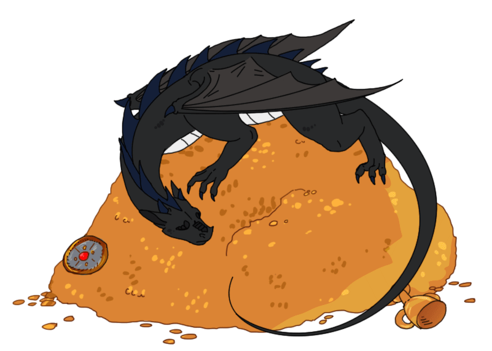

### Hi there, glad to see you here

---

I am Piotr, game developer from Poland. Best known as [Blood West](https://store.steampowered.com/app/1587130/Blood_West) CTO, but I've also contributed to some Open Source Projects. In my free time I love to meddle with tinkerable things, do some basic art, and sometimes practice lucid dreaming (someone might ask why during business meetings...)

My tech stack is mostly Unity these days, altrough I took my share with Rust (love it!) and C++ (less-love it...). My very virst video game was concieved in former century (it was a PowerPoint game book in 1999 actually). I am also co-founder and first chairman of SKN Artefakty - gamedev related Student's organization at University of Lodz.

Hope to bring more open-source project to bear here, you can explore what I already have to offer below. Oh, and regarding animations on this page - these were comissioned by me and executed by the talented artist, [Spiritaelia](https://www.deviantart.com/spiritaelia) (originals [here](https://www.deviantart.com/spiritaelia/art/Bed-of-gold-Stable-Animation-609846077) and [here](https://www.deviantart.com/spiritaelia/art/COM-Stray-Soul-4-762064293) ).

Cheers,
Stray Soul 'aka Shelim

---

